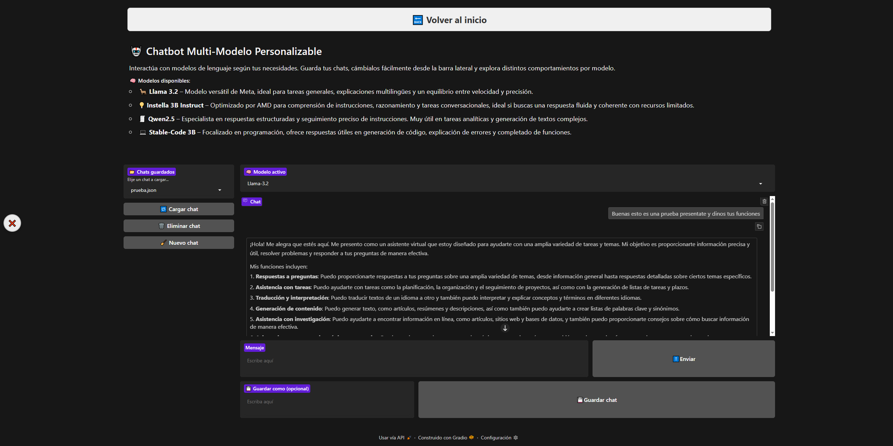
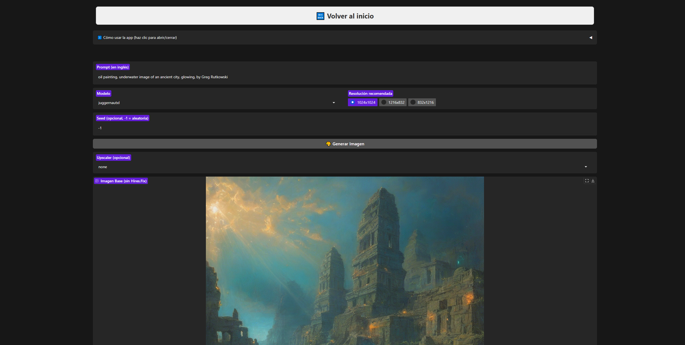
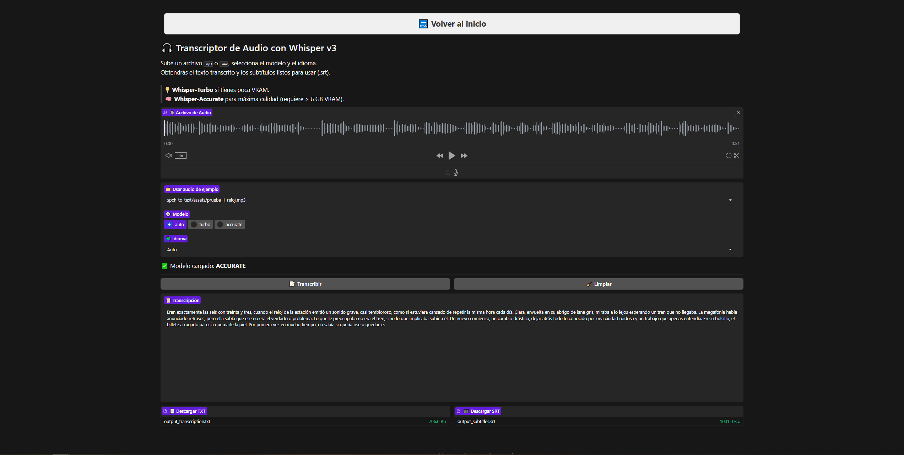

# LocalHub

  

**LocalHub** es una aplicación **local** (no servidor público) basada en **FastAPI + Gradio** que integra tres mini-apps de inteligencia artificial:

- 🤖 **Chatbot Multi-Modelo** (~3 B parámetros)  
- 🖼️ **Generador de imágenes** con Realistic Vision V6 B1 y Juggernaut XL v9
- 🎤 **Transcriptor de audio** con Whisper (“light” y “turbo”)

# Preview:

### 🖼️ Vista general de LocalHub


---

### 🤖 Chatbot Multi-Modelo



---

### 🖼️ Generador de Imágenes



---

### 🎤 Transcriptor de audio



---

## 📑 Índice

1. [📋Requisitos](#1-requisitos)  
2. [🔧Instalación](#2-instalación)  
3. [🚀Despliegue WebApp](#3-despliegue-de-la-aplicación-web)  
4. [🤖Chatbot Multi-Modelo Personalizable](#4-chatbot-multi-modelo-personalizable)  
5. [🖼️Generador de Imágenes](#5-generador-de-imágenes)  
6. [🎤Transcriptor de Audio (Whisper)](#6-transcriptor-de-audio-whisper)
7. [✨Extras](#7✨-extras)   
8. [📄Licencia](#8📄-licencia)


---

## 1. 📋 Requisitos

- **Python** ≥ 3.10  
- **CUDA** 12.x + driver compatible _(opcional para GPU)_
- **SO**: Windows / Linux / macOS  
- **RAM**: ≥ 8 GB  
- **VRAM**:  
  - ≥ 4 GB (minimo) 
  - ≥ 6 GB (básico) 
  - ≥ 8 GB (recomendado)
  - ≥ 10 GB (ideal)   

---

## 2. 🔧 Instalación

### 2.1) Clonar el repositorio

```bash
git clone https://github.com/vjimmes2003/LocalHub.git
cd LocalHub
```

### 2.2) Crear el entorno virtual

```bash
python -m venv .venv
```

### 2.3) Activar el entorno virtual

**PowerShell:**
```bash
.venv\Scripts\Activate.ps1
```

**CMD:**
```bash
.venv\Scripts\activate.bat
```

### 2.4) Actualizar pip e instalar dependencias

```bash
pip install --upgrade pip
pip install -r requirements.txt
```

### 2.5) Iniciar sesión en Hugging Face CLI

```bash
huggingface-cli login
```

Visita [https://huggingface.co/settings/token](https://huggingface.co/settings/token) y genera un **token de lectura**.  

ℹ️ **Nota**: El modelo **Llama 3.2** es *gated* y requiere aprobación previa.  
Puedes solicitar acceso desde [la página oficial del modelo](https://huggingface.co/meta-llama/Llama-3.2-3B-Instruct).

Pega el token con clic derecho cuando te lo pida la consola.


### 2.6) 🧰 Hotfix de `basicsr` (hasta que se  arregle)

`RealESRGAN` depende de la librería `basicsr`, que puede tener un **bug en versiones recientes** (import desde `functional_tensor` en lugar de `functional`).

Para evitar errores, una vez has terminado todo ejecuta este script:

```bash
python hotfix_basicsr.py
```

### 2.7) ❗Instalar `ffmpeg` (requerido para audio)

Whisper necesita `ffmpeg` para procesar correctamente los archivos `.mp3` y `.wav`.

#### Windows:
Usa Chocolatey (recomendado):

```bash
choco install ffmpeg
```
---

## 3.🚀 Despliegue de la aplicación web

Ejecuta todas las mini-apps con un solo comando:

```bash
uvicorn app:app --host 0.0.0.0 --port 5123
```

- Los modelos se descargan y cargan en `chatbot/models/…` la primera vez que los usas.  
- Detecta y usa GPU si está disponible (si no, cae a CPU sin problemas).  
- La interfaz de Gradio agrupa las tres funcionalidades:

  - 🤖 **Chatbot Multi-Modelo**  
  - 🖼️ **Generador de Imágenes**  
  - 🎤 **Transcriptor de Audio (Whisper)**

---

## 4.🤖 Chatbot Multi-Modelo Personalizable

Interactúa con cuatro modelos de ~3 B parámetros. Cada uno está optimizado para una tarea específica:

| Selector        | Alias interno               | Especialidad                                          |
|-----------------|-----------------------------|-------------------------------------------------------|
| **Llama 3.2**   | Llama-3.2-3B-Instruct       | Tareas generales y explicaciones multilingües        |
| **Instella 3B** | Instella-3B-Instruct        | Razonamiento paso a paso y conversación fluida       |
| **Qwen2.5**     | Qwen2.5-3B-Instruct         | Esquemas, listas y respuestas bien estructuradas     |
| **Stable-Code** | stable-code-instruct-3b     | Código, explicaciones técnicas y depuración          |

---

### 4.1⚙️ Características

#### 4.1.1📦 Carga y caché local

- Primer uso descarga el modelo en `chatbot/models/<Alias>/`
- Usa `cache_dir` para evitar descargas repetidas

#### 4.1.2⚖️ Gestión de GPU/CPU

- `device_map="auto"` reparte el modelo entre GPU y CPU  
- `torch_dtype=float16` reduce el uso de VRAM  
- Reserva el 90% de la GPU para el modelo (el resto se deja como buffer)  
- Limpia la caché al cambiar de modelo con `torch.cuda.empty_cache()`

#### 4.1.3🧾 Prompts inteligentes

- `DEFAULT_SYSTEM_PROMPT`: obliga a responder siempre en **español**
- `PER_MODEL_PROMPT`: adapta las respuestas según la especialización del modelo

#### 4.1.4📝 Streaming de respuestas

- Muestra tokens en tiempo real con `TextIteratorStreamer`
- Refresca la interfaz cada 0.5 segundos

#### 4.1.5💬 Gestión de conversaciones

- Guarda, carga y elimina chats desde la barra lateral de Gradio
- Los JSON usan el alias (ej. `Llama-3.2`) en lugar del repo ID

#### 4.1.6🔌 Descarga manual del modelo desde la interfaz

- Se ha añadido un botón **"🔌 Descargar modelo de VRAM"** directamente en la interfaz del Chatbot.
- Permite liberar la GPU manualmente cuando terminas una conversación o si el modelo se queda pillado.
- También se usa este botón para reiniciar el estado si se detectan errores de carga o saturación.

> El botón se encuentra justo debajo del selector de modelo.

---

## 5🖼️ Generador de Imágenes


Este módulo permite generar imágenes a partir de texto (`txt2img`) usando modelos locales optimizados. 

La app utiliza Gradio como frontend y FastAPI para su integración en la web principal.

---

### 5.1⚙️ Características principales

#### 5.1.1🎨 Modelos soportados

Actualmente se soportan dos modelos con configuraciones distintas:

| Modelo                    | Tipo            | Resoluciones disponibles              | Optimizaciones  |
|--------------------------|------------------|----------------------------------------|-----------------|
| `realisticvision-v6`     | `sd15_safetensors` | 512x768, 768x512, 640x832, ...         | Hires.Fix, Upscaler |
| `juggernautxl`           | `sdxl_safetensors` | 1024x1024, 896x1152, 1216x832, ...     | Upscaler       |

Cada modelo se define en `images/utils/config.py` e incluye:

- `repo_id`: repositorio de Hugging Face
- `type`: tipo (`sd15_safetensors`, `sdxl_safetensors`, etc.)
- `cfg_scale`, `steps`, y resoluciones

---

#### 5.1.2🧠 Flujo de generación

1. Se selecciona un modelo, prompt, resolución, y (opcionalmente) un `seed`.
2. El modelo se carga y cachea si no lo estaba.
3. Se genera la imagen base.
4. Se aplica `Hires.Fix` automáticamente si el modelo lo permite (`type == sd15_safetensors`).
5. Si el usuario lo indica, se aplica un `Upscaler` (`realistic`, `anime`, `general`).
6. Ambas versiones se guardan y muestran al usuario (`_base.png` y `_final.png`).

---

#### 5.1.3🧪 Mejoras automáticas

- **Hires.Fix**: mejora la nitidez y detalle aplicando `denoising_strength` y `upscale_factor` configurables.
- **Upscaler**: integra `RealESRGAN` con varios modelos para mejorar la resolución final.

Ambas funciones están desacopladas y definidas en:

- `images/utils/hires_fix.py`
- `images/utils/upscaler.py`

---

### 5.1.4🧩 Interfaz visual

La UI de Gradio permite:
- Interfaz con botón para desplegar ayuda de como usar la aplicación
  - Visualizar ejemplos con botones de "ANTES" y "DESPUÉS"
  - Las imágenes están generadas con la semilla 42 por si quieres comprobarlo.

- Escribir el prompt  
- Seleccionar modelo
- Elegir resolución recomendada (según el modelo)
- Establecer seed (opcional, usado para reproducibilidad de imágenes)
- Seleccionar upscaler (opcional)
- Ver resultados: imagen base y final
- Recargar galería de imágenes generadas

---

### 5.1.5🖼️ Galerías automáticas

Se listan y actualizan automáticamente desde `/images/outputs/`:

- Imágenes base (`*_base.png`)
- Imágenes finales (`*_final.png`)

Cada generación añade los nuevos archivos ordenados por fecha reciente.

---

### 5.1.6⏱️ Vigilancia automática y descarga de modelos

Cada vez que se genera una imagen, LocalHub evalúa el **uso actual de memoria RAM y VRAM** desde consola.  
Esto te permite ver si tu GPU está saturada y actuar en consecuencia (reiniciar, descargar modelos, etc.).

Además, si una generación tarda más de 2 minutos, el modelo se descarga automáticamente para evitar bloqueos.  
Este sistema actúa como mecanismo de seguridad para liberar la GPU sin intervención manual.

> ⚠️ Este comportamiento solo es visible desde la **consola**, no desde la interfaz de usuario.

---

## 6.🎤 Transcriptor de Audio con Whisper v3

Esta app permite transcribir archivos `.mp3` o `.wav` a texto con marcas de tiempo. 

Usa modelos locales (`faster-whisper`) optimizados para ejecutarse en GPU o CPU.

### 6.1🚀 Características destacadas

- Carga modelos automáticamente (turbo o accurate).
- Detección automática de idioma o selección manual.
- Salida en formato `.txt` y `.srt`.
- Muestra texto en tiempo real tras procesar el audio.
- **Incluye audios de prueba** para testear directamente.
- Además, se ha añadido un botón para **descargar el modelo cargado de la VRAM** manualmente.
- Esto permite liberar memoria cuando terminas una transcripción larga o deseas cambiar de modelo.


### 6.2📁 Audios de ejemplo

Incluidos por defecto dentro de `/spch_to_text/assets/`:

- `prueba_1_reloj.mp3`: Voz clara con palabras comunes.
- `prueba_2_silencio.mp3`: Prueba de detección en fragmentos vacíos.
- `prueba_3_lucia.mp3`: Narración fluida con expresividad.

### 6.3🧠 Modelos utilizados

| Modo       | Modelo                                   | VRAM recomendada |
|------------|-------------------------------------------|------------------|
| `turbo`    | `mobiuslabsgmbh/faster-whisper-large-v3-turbo` | ≥ 6 GB          |
| `accurate` | `Systran/faster-whisper-large-v3`        | ≥ 10 GB           |

Los modelos se almacenan localmente en `/spch_to_text/models`.

---

## 7.✨ Extras

### 7.1 Pruebas automatizadas del Chatbot

```bash
python -m chatbot.test_models
```

- Ejecuta 5 preguntas por modelo  
- Mide tiempos de carga y generación  
- Registra uso de VRAM antes/después  
- Guarda ejemplos en: `chatbot/saved_chats/Ejemplo_<Alias>.json`

### 7.2 Ejemplos de imágenes para Generador de imágenes

```bash
python -m images.generar_ejemplos
```

- Crea 5 imágenes por modelo  
- Mide tiempos de creación de todos los pasos   
- Guarda ejemplos en: 
  - `images/examples/<Modelo>_<número>_base.json`
  - `images/examples/<Modelo>_<número>_final.json`

### 7.3 🧠 Autogestión de Recursos

- Todas las miniapps (`chatbot`, `images`, `spch_to_text`) cuentan ahora con un **sistema de timeout**.
- Si una operación tarda **más de 2 minutos**, se asume que está colgada y el modelo se descarga de la VRAM automáticamente.
- Este sistema evita bloqueos persistentes y mejora la estabilidad general del sistema.
- También se imprime en consola el uso de recursos antes de cada generación de imagen:
- Además del sistema automático de timeout, **se han añadido botones manuales en Chatbot y Spch_to_Text** para permitir al usuario descargar el modelo activamente desde la interfaz de Gradio.

> Si ves valores muy altos, es recomendable **cerrar otras aplicaciones o descargar modelos que no estés usando**.

---

## 8.📄 Licencia

Este proyecto está bajo la licencia MIT.  
© 2025 vjimmes2003

---
